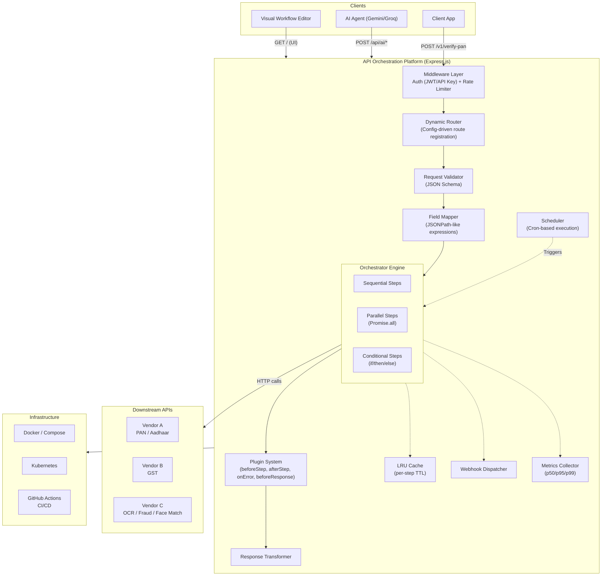
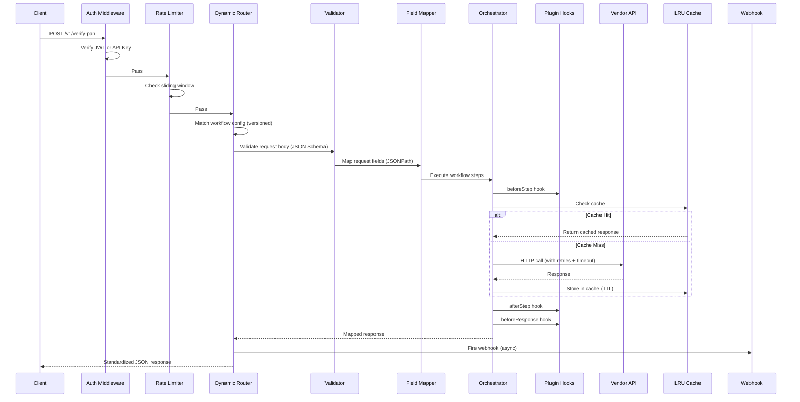
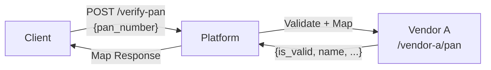
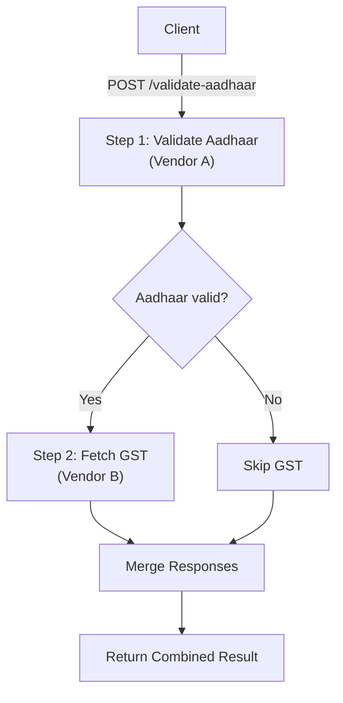
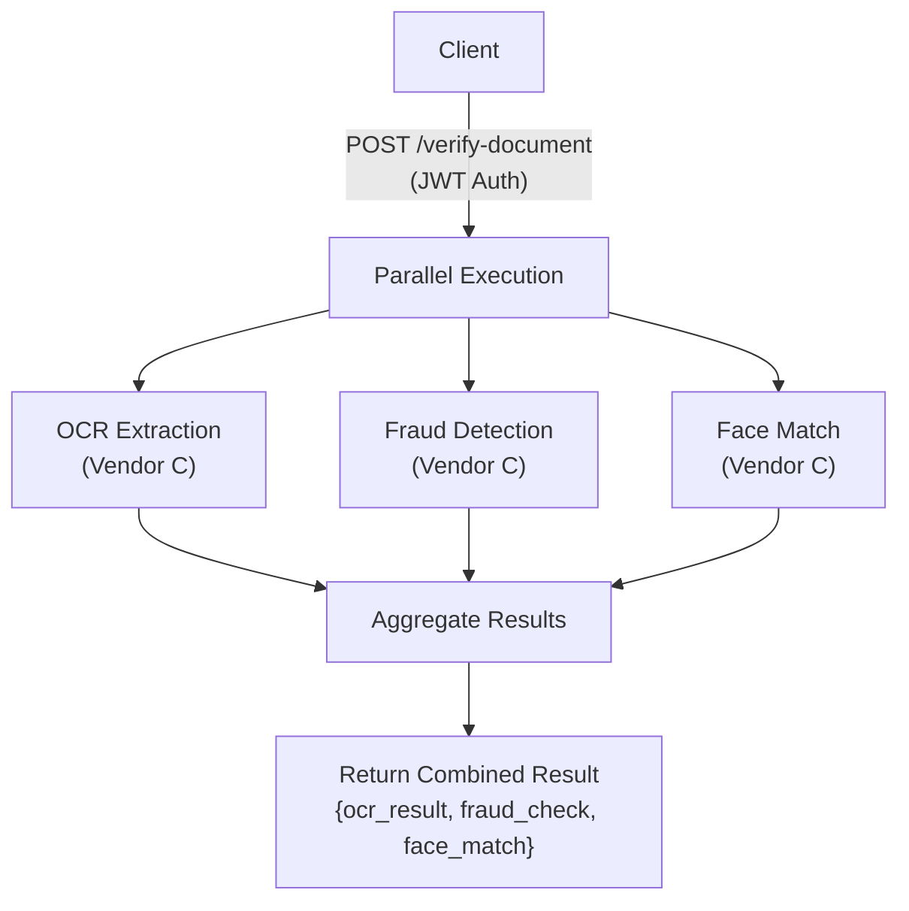
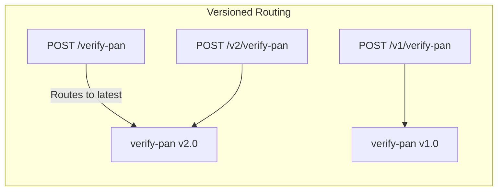
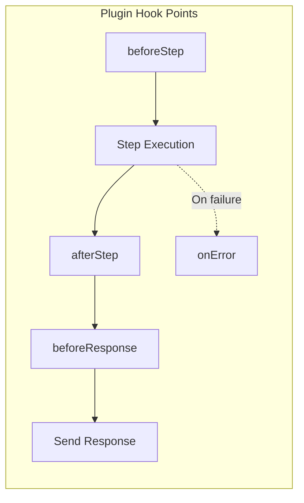
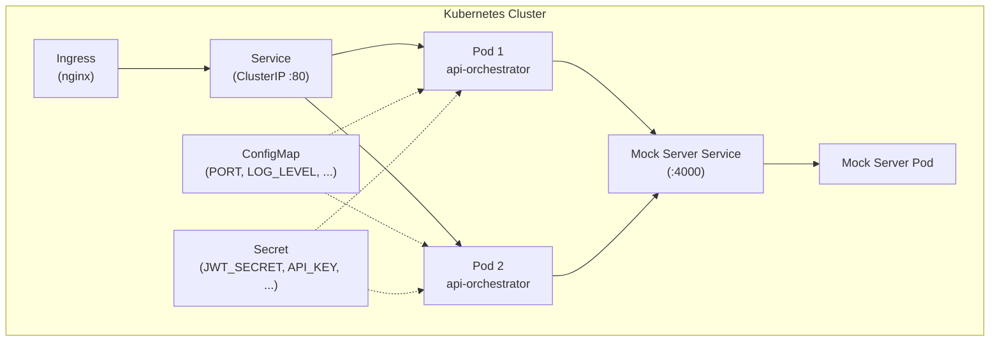
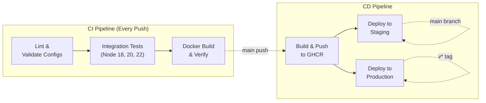

# Low-Code API Orchestration Platform


A **configuration-driven API orchestration platform** that allows users to expose their own REST APIs without writing business logic for each integration. Define an API using JSON configuration, map request and response fields, invoke one or more downstream APIs, transform data, and return standardized responses — all without changing application code.

> **Live Demo**: [Deployed on Render](https://signzy-intern-assignment-1.onrender.com)

---

## Architecture



---

## Request Execution Flow



---

## Quick Start

### Prerequisites
- Node.js 18+ (uses native `fetch`)
- Docker (optional)

### Installation

```bash
cd AvasuPalvashKumar_1
npm install
```

### Running Locally

```bash
# Terminal 1: Start mock vendor APIs
npm run mock

# Terminal 2: Start the platform
npm run dev
```

The platform starts on `http://localhost:3000`:

| URL | Description |
|-----|-------------|
| http://localhost:3000 | Visual Workflow Editor |
| http://localhost:3000/api-docs | Swagger/OpenAPI Spec |
| http://localhost:3000/metrics | Performance Metrics |
| http://localhost:3000/health | Health Check |

### Docker

```bash
docker compose up --build
```

This starts both the **platform** (port 3000) and the **mock server** (port 4000) in separate containers.

---

## Sample Requests & Responses

### 1. PAN Verification (Single Vendor API Call)

```bash
curl -X POST http://localhost:3000/verify-pan \
  -H "Content-Type: application/json" \
  -H "X-API-Key: test-api-key-12345" \
  -d '{"pan_number": "ABCDE1234F"}'
```

**Response:**
```json
{
  "success": true,
  "data": {
    "verified": true,
    "name": "Rajesh Kumar Sharma",
    "pan_number": "ABCDE1234F",
    "category": "Individual",
    "status": "ACTIVE"
  },
  "meta": {
    "correlationId": "a1b2c3d4-...",
    "workflowId": "verify-pan",
    "version": "1.0",
    "duration": "245ms",
    "executionLog": [
      { "stepId": "call_vendor_a", "type": "api_call", "duration": 210, "status": "success" }
    ]
  }
}
```



### 2. Aadhaar Validation with Conditional GST Fetch

```bash
curl -X POST http://localhost:3000/validate-aadhaar \
  -H "Content-Type: application/json" \
  -H "X-API-Key: test-api-key-12345" \
  -d '{"aadhaar_number": "123456789012"}'
```



### 3. Document Verification (Parallel Pipeline)

```bash
# Get a JWT token first
TOKEN=$(curl -s -X POST http://localhost:3000/api/auth/token \
  -H "Content-Type: application/json" \
  -d '{"sub":"demo"}' | jq -r '.token')

# Call with JWT
curl -X POST http://localhost:3000/verify-document \
  -H "Content-Type: application/json" \
  -H "Authorization: Bearer $TOKEN" \
  -d '{"document_type":"pan_card","document_data":"base64...","selfie_data":"base64..."}'
```



### 4. AI-Generated Workflow

```bash
curl -X POST http://localhost:3000/api/ai/generate-workflow \
  -H "Content-Type: application/json" \
  -d '{"description": "Create an API that validates a PAN using Vendor A and, if successful, fetches GST details from Vendor B."}'
```

The AI agent generates the full workflow JSON configuration automatically.

### 5. Versioned API Call

```bash
# Call a specific version
curl -X POST http://localhost:3000/v1/verify-pan \
  -H "Content-Type: application/json" \
  -H "X-API-Key: test-api-key-12345" \
  -d '{"pan_number": "ABCDE1234F"}'
```

---

## Configuration Format

Workflows are JSON files in the `configs/` directory. Each file becomes a live API endpoint:

```json
{
  "id": "verify-pan",
  "version": "1.0",
  "endpoint": { "method": "POST", "path": "/verify-pan" },
  "auth": { "type": "api_key" },
  "rateLimit": { "windowMs": 60000, "max": 50 },
  "request": {
    "schema": {
      "type": "object",
      "properties": {
        "pan_number": { "type": "string", "pattern": "^[A-Z]{5}[0-9]{4}[A-Z]$" }
      },
      "required": ["pan_number"]
    }
  },
  "steps": [
    {
      "id": "call_vendor_a",
      "type": "api_call",
      "vendor": {
        "url": "{{MOCK_SERVER}}/vendor-a/pan",
        "method": "POST",
        "headers": { "X-Vendor-Key": "vendor-a-secret" }
      },
      "requestMapping": { "pan": "$.body.pan_number" },
      "retries": 2,
      "retryDelay": 1000,
      "timeout": 5000,
      "cache": { "ttl": 300 }
    }
  ],
  "response": {
    "mapping": {
      "verified": "$.steps.call_vendor_a.response.is_valid",
      "name": "$.steps.call_vendor_a.response.name"
    },
    "statusCode": 200
  },
  "webhook": {
    "url": "https://hooks.example.com/notify",
    "events": ["success", "failure"]
  },
  "schedule": {
    "cron": "0 */6 * * *",
    "payload": { "pan_number": "ABCDE1234F" }
  }
}
```

### Step Types

| Type | Description | Example |
|------|-------------|---------|
| `api_call` | Call a downstream vendor API | PAN verification via Vendor A |
| `conditional` | If/then/else branching based on prior step results | If Aadhaar valid → fetch GST |
| `parallel` | Run multiple steps concurrently via `Promise.all` | OCR + Fraud + Face Match |

### Field Mapping (JSONPath-like)

| Expression | Description |
|------------|-------------|
| `$.body.field_name` | Access incoming request body fields |
| `$.steps.step_id.response.field` | Access a previous step's response |
| `$.headers.field` | Access request headers |
| `{{MOCK_SERVER}}` | Template variable (replaced from environment) |

---

## Features

### Core Features
- ✅ **Dynamic API creation** — define endpoints through JSON configuration
- ✅ **Request validation** — JSON Schema-based input validation
- ✅ **Request/response field mapping** — JSONPath-like expressions
- ✅ **HTTP API invocation** — with retries, exponential backoff, and timeouts
- ✅ **Multiple API orchestration** — sequential, parallel, and conditional execution
- ✅ **Conditional execution** — if/then/else branching based on step results
- ✅ **Error handling** — structured error responses with correlation IDs
- ✅ **Standardized response format** — consistent `{success, data, meta}` structure
- ✅ **Execution logging** — per-step timing, status, and full execution trace

### Bonus Features (All 15 Implemented)

| # | Feature | Description |
|---|---------|-------------|
| 1 | **Visual Workflow Editor** | Drag-and-drop workflow builder served at `/` |
| 2 | **Authentication (JWT/API Key)** | Per-route configurable auth via workflow config |
| 3 | **Rate Limiting** | Sliding window rate limiter, per-route configurable |
| 4 | **Versioned APIs** | Routes served at `/v1/path`, `/v2/path` etc. based on config version |
| 5 | **Metrics Endpoint** | `GET /metrics` with per-workflow p50/p95/p99 latencies |
| 6 | **Docker Support** | `Dockerfile` + `docker-compose.yml` for containerized deployment |
| 7 | **Swagger/OpenAPI** | Auto-generated OpenAPI 3.0 spec at `/api-docs` from configs |
| 8 | **Workflow Versioning** | Multiple versions of the same workflow, latest served by default |
| 9 | **Parallel Execution** | `Promise.all` for concurrent vendor API calls |
| 10 | **Webhook Support** | Post-execution HTTP callbacks on success/failure |
| 11 | **Scheduled Execution** | Cron-based workflow scheduling with in-memory scheduler |
| 12 | **Caching** | In-memory LRU cache with per-step TTL |
| 13 | **Plugin Architecture** | Extensible hook system (beforeStep, afterStep, onError, beforeResponse) |
| 14 | **Kubernetes Deployment** | Full k8s manifests (Deployment, Service, Ingress, ConfigMap, Secret) |
| 15 | **CI/CD Pipeline** | GitHub Actions: Lint → Test (Node 18/20/22) → Docker → Deploy |

### Agentic AI (Gemini / Groq / OpenAI)

| Capability | Endpoint | Description |
|------------|----------|-------------|
| Natural Language → Config | `POST /api/ai/generate-workflow` | Describe an API in plain English, AI generates the full workflow JSON |
| Config Validation | `POST /api/ai/validate` | AI analyzes config for issues and assigns a quality score (0–100) |
| Improvement Suggestions | `POST /api/ai/suggest` | AI recommends performance, reliability, and security improvements |
| Test Case Generation | `POST /api/ai/generate-tests` | AI generates comprehensive test cases with curl commands |
| Auto Field Mappings | `POST /api/ai/generate-mappings` | AI maps fields between source and target schemas |

---

## Detailed Feature Documentation

### Versioned APIs & Workflow Versioning

Each workflow config has a `version` field (e.g., `"1.0"`, `"2.0"`). The platform:

1. **Registers versioned routes**: `POST /v1/verify-pan`, `POST /v2/verify-pan`
2. **Unversioned routes point to latest**: `POST /verify-pan` → latest version
3. **Query specific versions**: `GET /api/workflows/verify-pan?version=1.0`
4. **List all versions**: `GET /api/workflows/verify-pan/versions`



### Scheduled Execution

Workflows can run on a cron schedule. Configure via the `schedule` field in workflow config or via API:

```bash
# Create a schedule via API
curl -X POST http://localhost:3000/api/schedules \
  -H "Content-Type: application/json" \
  -d '{
    "id": "pan-check-hourly",
    "workflowId": "verify-pan",
    "cron": "0 * * * *",
    "payload": {"pan_number": "ABCDE1234F"}
  }'

# List active schedules
curl http://localhost:3000/api/schedules

# Stop a schedule
curl -X DELETE http://localhost:3000/api/schedules/pan-check-hourly
```

**Cron format**: `minute hour day-of-month month day-of-week` (standard 5-field).

### Plugin Architecture

Plugins are JavaScript modules in the `plugins/` directory. Each exports hooks that run during workflow execution:



**Creating a plugin** — add a `.js` file to `plugins/`:

```javascript
module.exports = {
  name: 'my-plugin',
  version: '1.0',
  hooks: {
    beforeStep(step, context, correlationId) {
      // Runs before each workflow step
    },
    afterStep(step, result, context, correlationId) {
      // Runs after each successful step
    },
    onError(step, error, context, correlationId) {
      // Runs when a step fails
    },
    beforeResponse(result, context, correlationId) {
      // Runs before sending final response — can transform result
      return result; // return modified result
    }
  }
};
```

**Included plugins**:
- `request-logger.js` — logs step lifecycle (start, complete, error) with correlation IDs
- `field-masker.js` — masks sensitive fields (PAN, Aadhaar) in API responses to prevent PII leakage

```bash
# List loaded plugins
curl http://localhost:3000/api/plugins
```

### Kubernetes Deployment

Full Kubernetes manifests are provided in the `k8s/` directory:



**Deploy to Kubernetes:**

```bash
# Create secrets (replace with real values)
kubectl create secret generic api-orchestrator-secrets \
  --from-literal=JWT_SECRET=your-secret \
  --from-literal=API_KEY=your-api-key \
  --from-literal=GEMINI_API_KEY=your-gemini-key

# Apply all manifests
kubectl apply -f k8s/
```

| Manifest | Description |
|----------|-------------|
| `deployment.yaml` | 2-replica deployment with resource limits, liveness/readiness probes |
| `service.yaml` | ClusterIP service on port 80 |
| `configmap.yaml` | Non-secret environment variables |
| `secret.yaml` | Template for sensitive credentials |
| `ingress.yaml` | Nginx ingress for external access |
| `mock-server.yaml` | Mock server deployment + service |

---

## API Reference

### Platform Management

| Method | Path | Description |
|--------|------|-------------|
| GET | `/health` | Health check (includes workflow, plugin, schedule counts) |
| GET | `/metrics` | Performance metrics with per-workflow p50/p95/p99 latencies |
| GET | `/api-docs` | Auto-generated OpenAPI 3.0 spec |
| GET | `/api/workflows` | List all workflows (latest versions) |
| GET | `/api/workflows/:id` | Get a specific workflow (`?version=1.0` for specific version) |
| GET | `/api/workflows/:id/versions` | List all versions of a workflow |
| POST | `/api/workflows` | Create or update a workflow |
| DELETE | `/api/workflows/:id` | Delete a workflow (`?version=1.0` to delete specific version) |
| POST | `/api/auth/token` | Generate a JWT token (for testing) |

### Schedule Management

| Method | Path | Description |
|--------|------|-------------|
| GET | `/api/schedules` | List all active scheduled workflows |
| POST | `/api/schedules` | Create a new schedule (`{id, workflowId, cron, payload}`) |
| DELETE | `/api/schedules/:id` | Stop and remove a schedule |

### Plugin Info

| Method | Path | Description |
|--------|------|-------------|
| GET | `/api/plugins` | List all loaded plugins with their hooks |

### AI Agent

| Method | Path | Description |
|--------|------|-------------|
| POST | `/api/ai/generate-workflow` | Natural language → workflow config |
| POST | `/api/ai/validate` | Validate a config and get quality score |
| POST | `/api/ai/suggest` | Get improvement suggestions |
| POST | `/api/ai/generate-tests` | Generate test cases with curl commands |
| POST | `/api/ai/generate-mappings` | Auto-generate field mappings |

### Dynamic Workflow Endpoints

Defined by configs in `configs/` — supports both versioned and unversioned paths:

| Path | Auth | Description |
|------|------|-------------|
| `POST /verify-pan` | API Key | PAN card verification (latest version) |
| `POST /v1/verify-pan` | API Key | PAN card verification (v1.0) |
| `POST /validate-aadhaar` | API Key | Aadhaar validation + conditional GST |
| `POST /verify-document` | JWT | Document verification (parallel pipeline) |

---

## Testing

```bash
# Start mock server and platform, then run the integration suite:
npm run mock &
npm run dev &
npm test
```

**21 integration tests** cover:

| Category | Tests |
|----------|-------|
| Health & Meta | Health check, metrics, OpenAPI spec, workflow listing |
| PAN Verification | Valid PAN, invalid format (400), missing auth (401) |
| Versioned APIs | Versioned route `/v1/verify-pan`, version listing, versioned swagger paths |
| Aadhaar Validation | Valid Aadhaar with conditional GST fetch |
| Document Verification | JWT requirement (401), full parallel pipeline with JWT |
| Workflow CRUD | Create workflow via API, delete workflow |
| Scheduled Execution | List schedules, create schedule, delete schedule, invalid cron rejection |
| Plugin Architecture | List plugins, verify plugin hooks |

---

## CI/CD Pipeline



### CI Pipeline (`.github/workflows/ci.yml`)

Triggers on every push to `main`/`develop` and all pull requests.

| Stage | What it does |
|-------|-------------|
| **Lint** | Validates all JSON workflow configs are parseable, checks for debug artifacts |
| **Test** | Matrix tests across Node 18/20/22. Starts mock server + platform, runs full integration suite, verifies OpenAPI spec and metrics endpoint |
| **Docker** | Builds Docker image, spins up a container, validates health check, verifies `docker compose build` |

### CD Pipeline (`.github/workflows/cd.yml`)

| Stage | Trigger | What it does |
|-------|---------|-------------|
| **Publish** | `main` push or `v*` tag | Builds Docker image, pushes to GitHub Container Registry |
| **Staging** | `main` push | Deploys latest image to staging environment |
| **Production** | `v*` tag (e.g. `v1.0.0`) | Deploys tagged image to production environment |

### Creating a Release

```bash
git tag v1.0.0
git push origin v1.0.0
# Triggers: CI tests → Docker build → Push to GHCR → Production deploy
```

---

## Tech Stack

| Component | Technology | Why |
|-----------|-----------|-----|
| Runtime | Node.js 18+ | Async-native, native fetch, no polyfills |
| Framework | Express | Industry standard, minimal overhead |
| Validation | jsonschema | JSON Schema validation without code generation |
| Auth | jsonwebtoken | JWT signing/verification |
| Logging | Winston | Structured logging with levels and correlation IDs |
| Config | JSON files | Zero-dependency, version-controllable, hot-reloadable |
| Frontend | Vanilla HTML/CSS/JS | No build step, no bloat, instant load |
| AI | Gemini / Groq / OpenAI | Multi-provider LLM, switchable via `LLM_PROVIDER` env |
| Container | Docker + Compose | Production-ready multi-service deployment |
| Orchestration | Kubernetes | Production k8s manifests with health probes and ingress |
| CI/CD | GitHub Actions | Lint → Test → Build → Deploy pipeline |

---

## Project Structure

```
├── configs/                    # Workflow configurations (JSON)
│   ├── verify-pan.json
│   ├── validate-aadhaar.json
│   └── document-verification.json
├── plugins/                    # Plugin modules (auto-loaded)
│   ├── request-logger.js      # Logs step lifecycle
│   └── field-masker.js        # Masks PII in responses
├── public/                     # Visual workflow editor (frontend)
│   ├── index.html
│   ├── style.css
│   └── app.js
├── src/
│   ├── index.js               # Express app entry point
│   ├── engine/
│   │   ├── orchestrator.js    # Core orchestration engine
│   │   ├── config-loader.js   # Config loader + versioning + hot-reload
│   │   ├── router.js          # Dynamic versioned route registration
│   │   ├── scheduler.js       # Cron-based workflow scheduler
│   │   ├── plugin-loader.js   # Plugin discovery and hook system
│   │   ├── validator.js       # JSON Schema validation
│   │   ├── mapper.js          # Field mapping (JSONPath)
│   │   ├── invoker.js         # HTTP client for vendor APIs
│   │   ├── cache.js           # In-memory LRU cache
│   │   └── webhook.js         # Post-execution webhooks
│   ├── middleware/
│   │   ├── auth.js            # JWT + API Key authentication
│   │   ├── rate-limiter.js    # Sliding window rate limiter
│   │   └── metrics.js         # Request metrics collector (p50/p95/p99)
│   ├── ai/
│   │   └── agent.js           # Multi-provider AI integration
│   ├── mock/
│   │   └── mock-server.js     # Mock vendor APIs (6 endpoints)
│   ├── docs/
│   │   └── swagger.js         # OpenAPI 3.0 spec generator
│   └── utils/
│       ├── logger.js          # Winston structured logger
│       └── resolver.js        # JSONPath-like resolver + condition evaluator
├── k8s/                        # Kubernetes deployment manifests
│   ├── deployment.yaml        # 2-replica deployment with health probes
│   ├── service.yaml           # ClusterIP service
│   ├── configmap.yaml         # Non-secret env vars
│   ├── secret.yaml            # Secret template
│   ├── ingress.yaml           # Nginx ingress
│   └── mock-server.yaml       # Mock server deployment + service
├── test/
│   └── run.js                 # 21 integration tests (zero dependencies)
├── .github/workflows/
│   ├── ci.yml                 # CI: Lint → Test (Node 18/20/22) → Docker
│   └── cd.yml                 # CD: GHCR → Staging/Production
├── Dockerfile
├── docker-compose.yml
├── package.json
└── .env
```

---

## Environment Variables

| Variable | Default | Description |
|----------|---------|-------------|
| `PORT` | `3000` | Server port |
| `MOCK_SERVER_URL` | `http://localhost:4000` | Mock vendor server URL |
| `JWT_SECRET` | `default-secret` | JWT signing secret |
| `API_KEY` | `test-api-key-12345` | API key for authenticated routes |
| `LLM_PROVIDER` | `gemini` | AI provider: `gemini`, `groq`, or `openai` |
| `GEMINI_API_KEY` | — | Google Gemini API key |
| `GROQ_API_KEY` | — | Groq API key (if using Groq) |
| `GROQ_MODEL` | `llama-3.3-70b-versatile` | Groq model name |
| `LOG_LEVEL` | `info` | Logging level: `debug`, `info`, `warn`, `error` |
